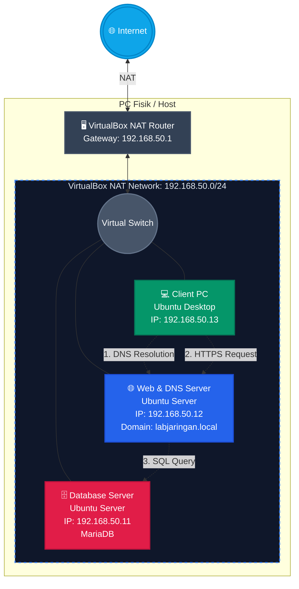

# 🌐 3-Tier Network Architecture Lab (Local)

  

## 📌 Project Overview

A hands-on home lab simulating a **production-like 3-Tier Network Architecture** built entirely on a local machine using Oracle VirtualBox. The lab has been expanded across 3 phases, covering core sysadmin skills: networking, web serving, security, and monitoring.

| Phase | Description | Status |
| :--- | :--- | :--- |
| Phase 1 | 3-Tier Network + DNS + WordPress | ✅ Done |
| Phase 2 | Nginx Reverse Proxy + HTTPS (SSL) | ✅ Done |
| Phase 3 | Monitoring: Prometheus + Grafana | ✅ Done |

---

## 🛠️ Tech Stack & Tools

| Category | Tools |
| :--- | :--- |
| **Virtualization** | Oracle VirtualBox (NAT Network) |
| **OS** | Ubuntu Server 25.04, Ubuntu Desktop 25.04 |
| **Web Server** | Apache2, PHP 8.x, Nginx (Reverse Proxy) |
| **Database** | MariaDB |
| **CMS** | WordPress |
| **DNS** | BIND9 |
| **Security** | OpenSSL (Self-Signed SSL), HTTPS |
| **Monitoring** | Prometheus v2.51.0, Node Exporter v1.7.0, Grafana v13.0.2 |
| **Networking** | Netplan, SSH |

---

## 🏗️ Network Topology



### VM Details

| Role | Hostname | OS | IP Address | Exposed Ports |
| :--- | :--- | :--- | :--- | :--- |
| **Database Server** | `db-server` | Ubuntu Server | `192.168.50.11` | `3306` (MariaDB) |
| **Web/DNS Server** | `web-server` | Ubuntu Server | `192.168.50.12` | `443` (HTTPS), `80` (redirect), `53` (DNS), `9090` (Prometheus), `3000` (Grafana) |
| **Client PC** | `client-pc` | Ubuntu Desktop | `192.168.50.13` | - |

> **Domain:** `https://labjaringan.local` → `192.168.50.12`

---

## 📂 Repository Structure

```
📁 3-Tier-Network-Architecture-Lab-Local-
├── 📁 config-netplan/              # Static IP configs (Netplan YAML)
├── 📁 config-dns/                  # BIND9 zone files & named.conf
├── 📁 scripts/                     # PHP test script & MariaDB SQL setup
├── 📁 nginx-reverse-proxy/
│   └── 📁 config/
│       ├── labjaringan.local       # Nginx reverse proxy config
│       └── labjaringan.crt         # Self-signed SSL certificate
├── 📁 monitoring/
│   ├── node_exporter.service       # Node Exporter systemd service
│   └── 📁 prometheus/
│       ├── prometheus.yml          # Prometheus scrape config
│       └── prometheus.service      # Prometheus systemd service
└── README.md
```

---

## ⚙️ Phase 1: 3-Tier Network + DNS + WordPress

### Overview
Simulates a production-like infrastructure where Client, Web Server, and Database Server reside on separate IPs but communicate securely. A local DNS server resolves a custom domain to the Web Server.

### Key Configurations
1. **Static Routing (Netplan)** — configured static IPs via YAML for headless servers
2. **Database Remote Access** — edited `bind-address` in MariaDB, restricted access to Web Server IP only
3. **Manual WordPress Deployment** — CLI-only install, set `www-data` directory ownership
4. **Local DNS (BIND9)** — custom zone file, resolves `labjaringan.local` → `192.168.50.12`

### Troubleshooting
- **YAML Indentation Error:** resolved `Invalid YAML: inconsistent indentation` in Netplan config
- **VirtualBox Gateway Timeout:** fixed by resetting VirtualBox internal DHCP service
- **mDNS Hijacking `.local`:** disabled `avahi-daemon`, modified `/etc/nsswitch.conf` (removed `mdns4_minimal`), set `DNSStubListener=no` in `resolved.conf`

---

## 🔒 Phase 2: Nginx Reverse Proxy + HTTPS

### Overview
Added Nginx as a reverse proxy in front of Apache with HTTPS via self-signed SSL certificate. Apache moved to port 8080, Nginx handles all external traffic.

### Traffic Flow
```
Client → Nginx :80 → (301 redirect) → Nginx :443 (SSL Termination) → Apache :8080 → WordPress
```

### Key Configurations
1. **Apache moved to port 8080** — edited `/etc/apache2/ports.conf` and virtualhost config
2. **Self-signed SSL** — generated with OpenSSL, 365 days validity
3. **Nginx reverse proxy** — SSL termination on port 443, forwards to `localhost:8080`
4. **HTTP → HTTPS redirect** — `return 301` in Nginx server block
5. **WordPress URL update** — updated `siteurl` and `home` in `wp_options` table to `https://`

### Troubleshooting
- **Port 80 conflict on Nginx start:** Apache was still on port 80 — moved to 8080 first before starting Nginx

---

## 📊 Phase 3: Monitoring Stack (Prometheus + Grafana)

### Overview
Real-time monitoring of the Web Server using Prometheus as metrics collector, Node Exporter as the metrics agent, and Grafana as the visualization dashboard.

### Architecture
```
Web Server → Node Exporter (:9100) → Prometheus (:9090) → Grafana (:3000)
```

### What's Monitored
- CPU, Memory, Disk usage
- Network traffic
- System uptime

### Key Configurations
1. **Node Exporter** — collects system metrics, runs as dedicated systemd service
2. **Prometheus** — scrapes Node Exporter every 15 seconds
3. **Grafana** — dashboard ID `1860` (Node Exporter Full), data source: Prometheus

### Access
| Service | URL |
| :--- | :--- |
| Prometheus | `http://192.168.50.12:9090` |
| Grafana | `http://192.168.50.12:3000` |

### Troubleshooting
- **Prometheus fails to start after config edit:** YAML indentation error in `prometheus.yml` — fixed by rewriting config from scratch with correct structure

---

*Built to strengthen IT Infrastructure, System Administration, and Networking skills.*
