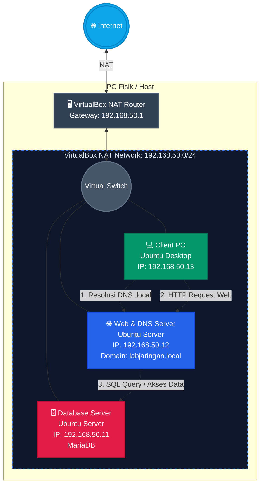

# 🌐 3-Tier Network Architecture Lab (Local)

## 📌 Project Overview
This project is a hands-on implementation of a **3-Tier Network Architecture** built entirely in a local environment using Oracle VirtualBox. The goal of this home lab is to simulate a production-like infrastructure where the Client, Web Server, and Database Server reside on separate IP addresses but can securely communicate with each other. 

Additionally, a local DNS Server was configured to resolve a custom domain name to the Web Server, bypassing the need to access the site via raw IP addresses.

## 🛠️ Tech Stack & Tools
* **Virtualization:** Oracle VirtualBox (Custom NAT Network Configuration)
* **Operating Systems:** * Ubuntu Server LTS 26.04 (Web & Database Server)
  * Ubuntu Desktop LTS (Client PC)
* **Web Server:** Apache2 & PHP 8.x
* **Database:** MariaDB (MySQL)
* **Content Management System (CMS):** WordPress
* **DNS Server:** BIND9
* **Networking:** Netplan (Static IP Routing), SSH

## 🏗️ Network Topology
The lab uses a custom VirtualBox `NatNetwork` (`192.168.50.0/24`) with the gateway set to `192.168.50.1`.

| Role | Hostname | OS | Static IP Address | Exposed Ports |
| :--- | :--- | :--- | :--- | :--- |
| **Database Server** | `db-server` | Ubuntu Server | `192.168.50.11` | `3306` (MariaDB) |
| **Web Server / DNS** | `web-server` | Ubuntu Server | `192.168.50.12` | `80` (HTTP), `53` (DNS) |
| **Client PC** | `client-pc` | Ubuntu Desktop | `192.168.50.13` | - |

> **Domain Name:** `http://labjaringan.local` resolves to `192.168.50.12`.

## ⚙️ Key Configurations & Features
1. **Static Routing (Netplan):** Configured static IPs and gateways via YAML (`/etc/netplan/`) for headless Linux servers.
2. **Database Remote Access:** Edited `bind-address` in MariaDB and assigned specific user privileges so that only the Web Server (`.12`) can access the database (`.11`).
3. **Manual WordPress Deployment:** Downloaded, extracted, and set directory ownership (`www-data`) for WordPress entirely via CLI.
4. **Local DNS Server (BIND9):** Created Forwarders and a custom Zone File (`db.labjaringan.local`) so the Client PC can access the web server using a custom domain.

## 🚧 Challenges & Troubleshooting
Building this from scratch presented several real-world System Administration challenges:
* **YAML Indentation Sensitivity:** Encountered and resolved `Invalid YAML: inconsistent indentation` errors during Netplan configuration. Learned that YAML is strictly space-based.
* **VirtualBox Gateway Timeout:** Overcame an isolated network issue where VMs could ping each other but not the gateway. Resolved by resetting the VirtualBox internal DHCP service.
* **Ubuntu mDNS Hijacking (`.local` domain):** The Ubuntu Client PC initially failed to resolve the `labjaringan.local` domain despite correct DNS settings. Successfully bypassed this by modifying `/etc/nsswitch.conf`, disabling Firefox's *Secure DNS*, and stopping the `avahi-daemon` (mDNS) service.

## 📂 Repository Structure
* `/config-netplan` - Contains the YAML configurations for assigning static IPs.
* `/config-dns` - Contains BIND9 zone files and configuration (`named.conf.options`, `named.conf.local`).
* `/scripts` - Contains the initial PHP testing script and MariaDB SQL setup commands.

---
*This project was built to strengthen fundamental IT Infrastructure, System Administration, and Networking skills.*
---

## 🔒 Phase 2: Nginx Reverse Proxy + HTTPS

### Overview
Added Nginx as a reverse proxy in front of Apache, with HTTPS using a self-signed SSL certificate.

### Updated Topology
Client PC → Nginx (:443 HTTPS) → Apache (:8080) → PHP/WordPress

### Key Configurations
1. **Apache moved to port 8080** - edited `/etc/apache2/ports.conf` and virtualhost config
2. **Self-signed SSL certificate** - generated with OpenSSL, validity 365 days
3. **Nginx reverse proxy** - listens on port 80 & 443, forwards to localhost:8080
4. **HTTP → HTTPS redirect** - `return 301` in Nginx config

### Updated Exposed Ports
| Service | Port |
| :--- | :--- |
| Nginx (HTTPS) | `443` |
| Nginx (HTTP redirect) | `80` |
| Apache (internal) | `8080` |

### Troubleshooting
* **Port 80 conflict on Nginx start:** Apache was still on port 80 — moved to 8080 first
* **DNS `.local` not resolving:** Disabled `avahi-daemon`, set `DNSStubListener=no` in `resolved.conf`, removed `mdns4_minimal` from `nsswitch.conf`

---

## 📊 Phase 3: Monitoring Stack (Prometheus + Grafana)

### Overview
Real-time monitoring of the Web Server using Prometheus as metrics collector and Grafana as the visualization dashboard.

### Tech Stack
- Prometheus v2.51.0
- Node Exporter v1.7.0
- Grafana v13.0.2

### Architecture
Node Exporter (:9100) → Prometheus (:9090) → Grafana (:3000)

### What's Monitored
- CPU, Memory, Disk usage
- Network traffic
- System uptime

### Key Configurations
1. **Node Exporter** - collects system metrics from Web Server
2. **Prometheus** - scrapes Node Exporter every 15s
3. **Grafana** - connected to Prometheus, using dashboard ID 1860 (Node Exporter Full)

### Access
| Service | Address |
| :--- | :--- |
| Prometheus | `http://192.168.50.12:9090` |
| Grafana | `http://192.168.50.12:3000` |

---

*This project was built to strengthen fundamental IT Infrastructure, System Administration, and Networking skills.*
